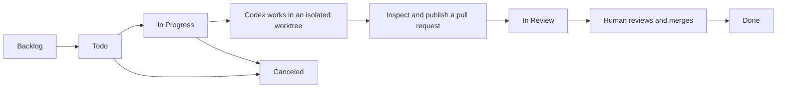

# Symphony (Go)

Symphony is a long-running, Codex-only issue runner. It reads repository-owned
policy from `WORKFLOW.md`, polls Linear, and runs each eligible issue in a
deterministic local workspace.

```sh
go run ./cmd/symphony --workflow ./WORKFLOW.md
```

## Using Symphony

Symphony turns focused Linear issues into isolated Codex workspaces while
keeping review and merge approval with a human. Today, the default workflow is
manual: you inspect the generated work, publish it, open a pull request, and
move the linked issue to `Done` after the pull request merges.



`Todo` and `In Progress` are the default active states: Symphony polls only
those states and starts Codex only for eligible issues. A `Todo` issue with an
unfinished blocker is held back. `In Review` is a useful optional handoff
state; configure it explicitly if you want a Codex session to hand its active
issue back for review. `Done` and `Canceled` are terminal, so Symphony stops
work and removes only workspaces that are safe to clean up. Your Linear team
defines the available state names; `active_states` and `terminal_states` in
`WORKFLOW.md` are the runtime source of truth.

### Your workflow

1. Create a small, clear issue in the configured Linear project. Put ready
   work in `Todo`; before implementation, move the issue to `In Progress`.
2. Check the workflow configuration and Linear connection without starting
   Codex:

   ```sh
   go run ./cmd/symphony --workflow ./WORKFLOW.md --dry-run
   ```

3. Start Symphony and leave it running while it polls for eligible issues:

   ```sh
   go run ./cmd/symphony --workflow ./WORKFLOW.md
   ```

4. Inspect the issue worktree below `workspace.root`, including uncommitted
   changes and any commits Codex created. With the example configuration:

   ```sh
   git -C .symphony/workspaces/<issue-worktree> status --short --branch
   git -C .symphony/workspaces/<issue-worktree> diff
   git -C .symphony/workspaces/<issue-worktree> log --oneline --decorate -5
   ```

5. Publish a focused branch and open a pull request using **Why**, **What was
   changed**, and **On Call** sections. Move the issue to `In Review`, complete
   the normal review, and merge only after required checks pass.
6. Move the issue to `Done` only after its pull request is merged. Use
   `Canceled` when the work will not continue.

Symphony records a completed turn and does not rerun an unchanged issue. A
later Linear edit makes it eligible for another turn. Terminal cleanup
preserves a worktree with uncommitted, untracked, or newly committed work.

### Planned optional GitHub lifecycle

[PMR-27](https://linear.app/pmrrasmussen/issue/PMR-27/add-optional-github-pr-lifecycle-integration)
tracks an opt-in host-side GitHub integration. It is not part of the current
configuration yet. It will target one fixed `owner/repository` and base branch,
using a repository-scoped fine-grained token loaded from an environment
reference or trusted local secret file. Once implemented, a configured
Symphony host will be able to verify committed clean work, publish a
deterministic issue branch, create or reuse its pull request, link it to the
active Linear issue, and hand that issue to review idempotently.

GitHub credentials will remain in the Symphony host process and will never be
passed to Codex. Symphony will observe only the linked pull request: a confirmed
human merge will move that issue to `Done`, while a close without merge will
leave it in review and notify the operator. Symphony will never approve or
merge a pull request. With GitHub integration absent or invalid, the manual
workflow above remains unchanged.

### Set up a repository

1. Copy [WORKFLOW.example.md](WORKFLOW.example.md) to `WORKFLOW.md` in the
   repository you want Symphony to work on. The file is versioned policy and
   also contains the prompt Codex receives.
2. Under `tracker.provider`, set `project_slug` to that Linear project's slug
   ID. Supply its API key with `api_key: $LINEAR_API_KEY`, or point
   `api_key_file` at a trusted local file; never commit the key.
3. Set the states Symphony should process and finish. The example uses
   `active_states: [Todo, In Progress]` and
   `terminal_states: [Done, Canceled]`. To enable the current scoped Codex
   handoff capability, also set `tracker.provider.handoff_state: In Review`
   and, optionally, a fixed `handoff_comment_template`.
4. Set `workspace.root` to a writable location and `workspace.source_root: .`
   to create a detached Git worktree for each issue. `source_root` must be a
   committed Git repository; Symphony never runs Codex in the original
   checkout.
5. Run the dry-run command above. Once it succeeds, start Symphony.

Linear credentials stay in the host process and are removed from Codex's
environment. `api_key_file` is read only by Symphony; restrict the file to the
service user, for example with mode `600` on Unix systems.

`WORKFLOW.md` front matter is validated for supported core fields while
unknown extension fields are preserved. Valid changes are reloaded for future
work; an invalid replacement keeps the last valid configuration. Prompt
templates use strict lowercase variables: `issue` (for example
`{{.issue.identifier}}`) and `attempt` (nil on the first run, then a 1-based
retry or continuation number). A template error fails only that run attempt.
Relative workspace and log paths resolve from the workflow file; omitted
`workspace.root` defaults to the system temporary directory's
`symphony_workspaces` path.

The optional current handoff capability is session-bound to the active issue
and configured project. Despite its compatibility name, `linear_graphql` is
not a general Linear or GraphQL tool; see the
[Linear tracker profile](docs/linear-tracker.md) for its strict scope.

For the full configuration, trust, and delivery contracts, see
[WORKFLOW.example.md](WORKFLOW.example.md),
[docs/architecture.md](docs/architecture.md), and
[HOW_WE_WORK.md](HOW_WE_WORK.md).

## Live smoke tests

Live smoke testing is opt-in. Use a separate, dedicated Linear project and
credentials, and always run `--dry-run` first. Never run a Symphony smoke test
against Dagligvare-app or any of its Linear workspace, team, or projects.

Report a smoke test as **skipped** when its dedicated credential or project is
unavailable, and as **failed** when an attempted command or validation fails.
A skipped smoke test is not a passed test.
