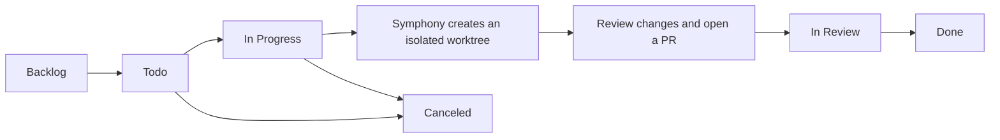

# Symphony (Go)

Symphony is a long-running, Codex-only issue runner. It reads repository-owned
policy from `WORKFLOW.md`, polls Linear, and runs each eligible issue in a
deterministic local workspace.

```sh
go run ./cmd/symphony --workflow ./WORKFLOW.md
```

## Using Symphony

Symphony turns focused Linear issues into isolated Codex workspaces. You keep
control of the work: decide which issues are eligible, inspect each worktree,
and create and review the pull request before marking the issue complete.



`Todo` and `In Progress` are the default active states: Symphony polls only
those states and starts Codex only for eligible issues. `Todo` issues with
unfinished blockers are held back. `In Review` is a useful optional handoff
state; configure it explicitly if you want Symphony to let Codex hand an issue
over. `Done` and `Canceled` are terminal, so Symphony stops work and cleans up
only workspaces that are safe to remove. The available state names come from
your Linear team; `active_states` and `terminal_states` in `WORKFLOW.md` are
the source of truth.

### Your workflow

1. Create a small, clear issue in the Linear project configured for Symphony.
   Put it in `Todo` when it is ready, or move it to `In Progress` when you want
   it picked up immediately.
2. Check the configuration and Linear connection without starting Codex:

   ```sh
   go run ./cmd/symphony --workflow ./WORKFLOW.md --dry-run
   ```

3. Start Symphony and leave it running while it polls for eligible issues:

   ```sh
   go run ./cmd/symphony --workflow ./WORKFLOW.md
   ```

4. Inspect the issue's generated worktree under `workspace.root` before you
   keep the change. For the example configuration, use:

   ```sh
   git -C .symphony/workspaces/<issue-worktree> status
   git -C .symphony/workspaces/<issue-worktree> diff
   ```

5. Create a pull request from the reviewed work, complete the normal review,
   and then move the Linear issue to `Done`. Use `Canceled` when the work will
   not continue. Do not move an issue to `Done` before its pull request merges.

Use a separate, dedicated Linear project and credentials for any live smoke
test. Always run `--dry-run` first. Never run a Symphony smoke test against
Dagligvare-app or any of its Linear workspace, team, or projects.

### Set up a repository

1. Copy [WORKFLOW.example.md](WORKFLOW.example.md) to `WORKFLOW.md` in the
   repository you want Symphony to work on. The file is versioned policy and
   also contains the prompt Codex receives.
2. Under `tracker.provider`, set `project_slug` to that Linear project's slug
   ID. Supply its API key with `api_key: $LINEAR_API_KEY`, or point
   `api_key_file` at a local file with mode `600`; never commit the key.
3. Set the states Symphony should process and finish. The example uses
   `active_states: [Todo, In Progress]` and
   `terminal_states: [Done, Canceled]`. If you use `In Review`, set
   `tracker.provider.handoff_state: In Review` as well.
4. Set `workspace.root` to a writable location and `workspace.source_root: .`
   to create a detached Git worktree for each issue. Keep `source_root` on a
   committed Git repository; Symphony never runs Codex in the original
   checkout.
5. Run the dry-run command above. Once it succeeds, start Symphony.

For all configuration fields, see [WORKFLOW.example.md](WORKFLOW.example.md)
and the [Linear tracker profile](docs/linear-tracker.md). The trust and
workspace model are described in [docs/architecture.md](docs/architecture.md).

Run with `--dry-run` to validate configuration and scheduling without starting
Codex. A live smoke test is opt-in: set `LINEAR_API_KEY`, configure a dedicated
Symphony test project in `WORKFLOW.md`, and use `--dry-run` first. Never run a
Symphony smoke test against Dagligvare-app or any of its Linear workspace,
team, or projects. Report a smoke test as **skipped** when its dedicated test
credential or project is unavailable; report it as **failed** when an attempted
test command or validation fails. A skipped smoke test is not a passed test.

Linear accepts `tracker.provider.api_key: $LINEAR_API_KEY` or a trusted local
`tracker.provider.api_key_file`; the latter is read only by the service.

`WORKFLOW.md` front matter is validated for the supported core fields while
unknown extension fields are preserved. Changes are reloaded for future work;
an invalid replacement keeps the last valid configuration. Prompt templates use
strict, lowercase variables: `issue` (for example
`{{.issue.identifier}}`) and `attempt` (nil on the first run, then a 1-based
retry/continuation number). Template errors fail only that run attempt.
Relative workspace and log paths are resolved from the workflow file; omitted
`workspace.root` defaults to the system temporary directory's
`symphony_workspaces` path.

See [docs/architecture.md](docs/architecture.md), the
[Linear tracker profile](docs/linear-tracker.md), and
[WORKFLOW.example.md](WORKFLOW.example.md).

To let a Codex session hand an issue off safely, optionally configure
`tracker.provider.handoff_state` (and, if useful, a fixed
`handoff_comment_template`). This enables a session-bound compatibility tool,
not general Linear or GraphQL access; see the Linear tracker profile for its
strict scope.
